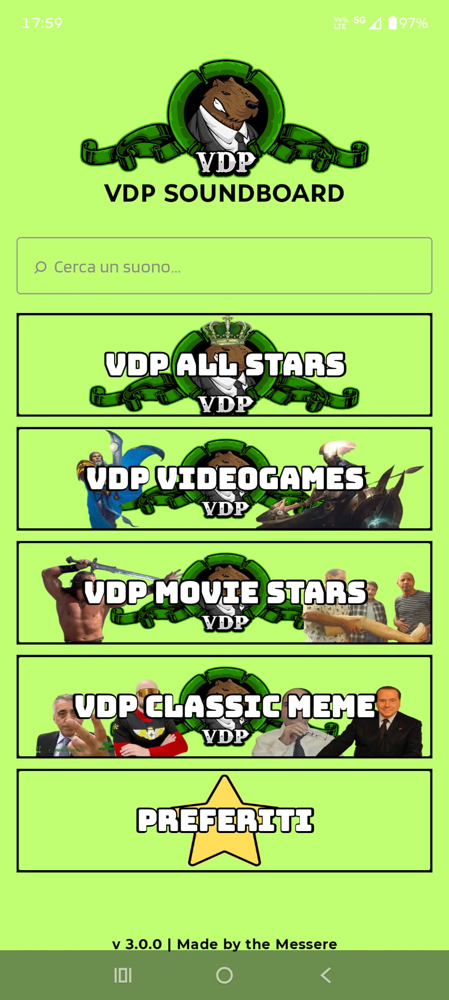
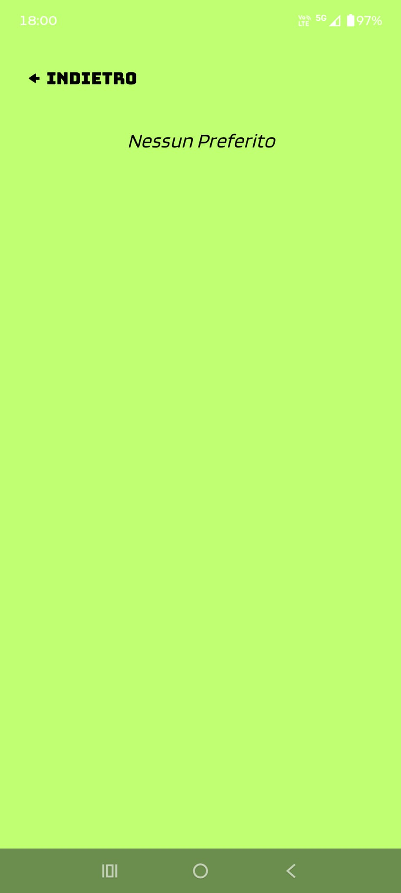
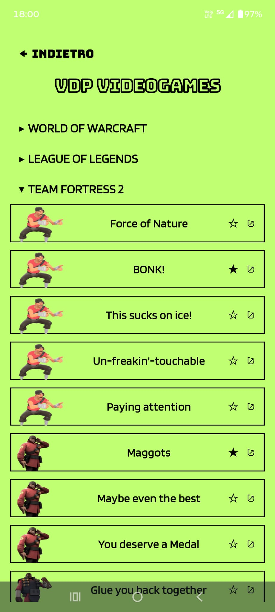
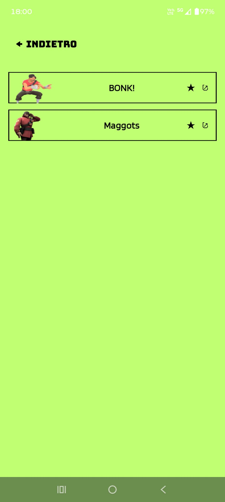
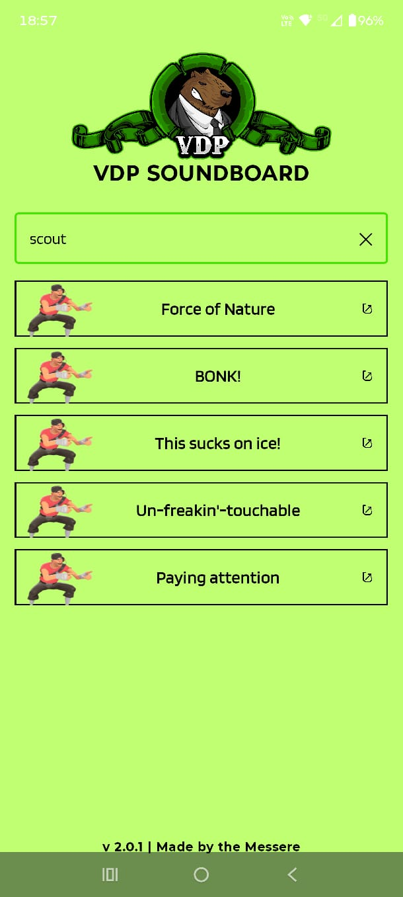
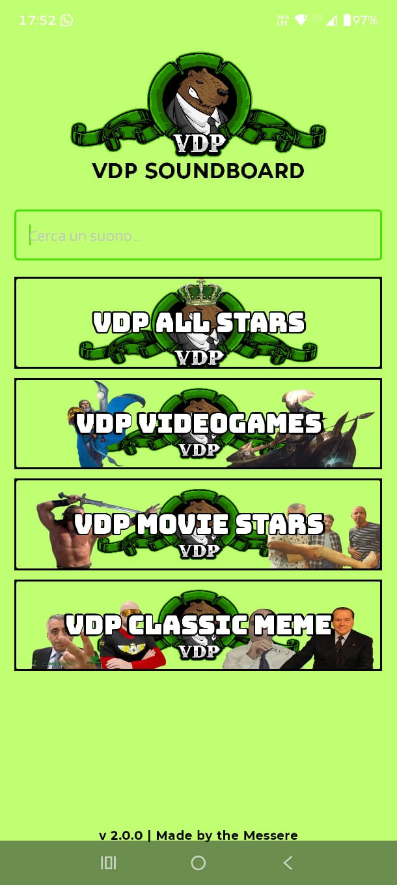
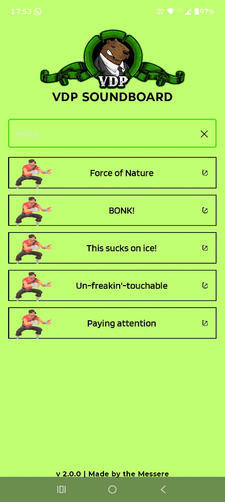
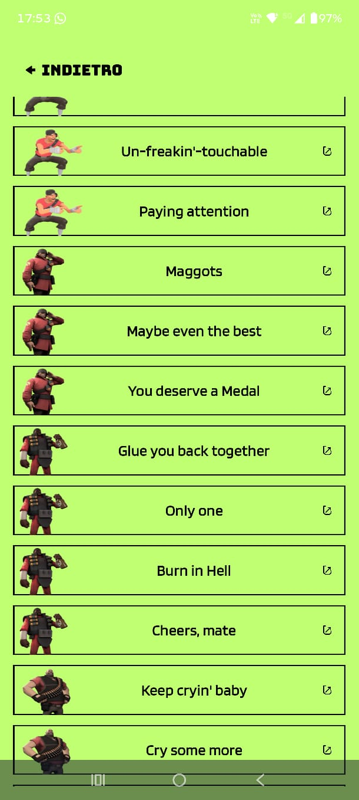

# Changelog

## Version 3.0.0

- Added Favorites feature
- Added persistent Favorites storage
- Added star buttons to every sound
- Added dedicated Favorites page
- Added new sounds

  
  

  
  

## Version 2.1.0

Version 2.1.0 introduces a new collection of sounds and updates the existing audio assets.

- Added new sounds and updated sound categories
- Standardized the existing OGG audio files for improved compatibility
- Converted audio assets to Opus OGG format at 48 kHz / 64 kbps
- Removed unnecessary metadata and non-audio streams from the OGG files
- Improved compatibility with mobile audio sharing

## Version 2.0.1

- Fixed audio sharing for a problematic sound file
- Corrected a search tag typo
- Improved search bar readability

  
  

## Version 2.0.0

Version 2.0.0 introduces a search system for the soundboard.

Sounds can be searched by title or through manually assigned search tags, allowing related sounds to be found even when their displayed titles do not directly match the search term.

The update also adds quick search clearing, scrollable search results, and persistent back navigation on sound category pages.

  
  
  

## Version 1.0.0

- Initial release
- Categorized soundboard interface
- Instant audio playback
- Audio sharing through Android intents
- Custom launcher icon
