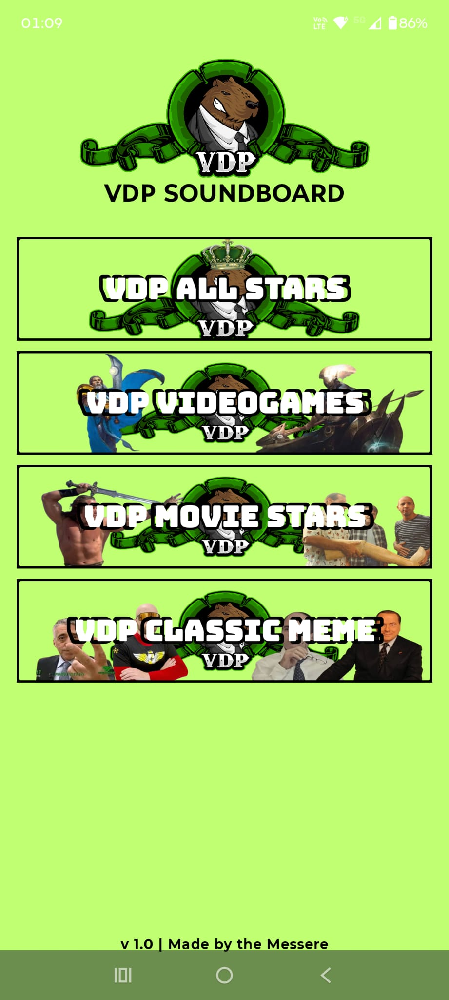
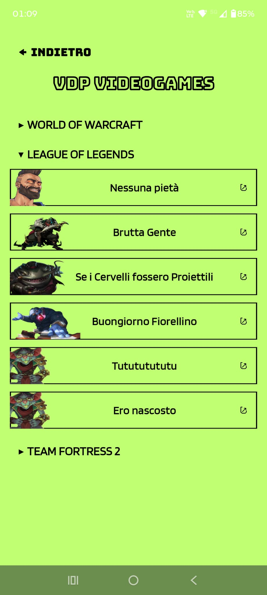
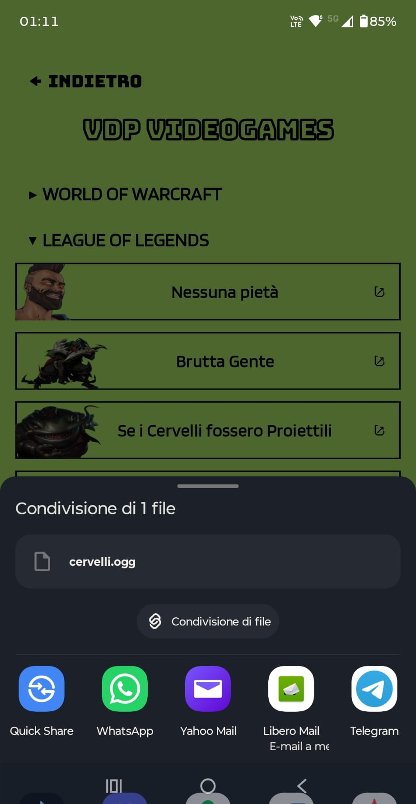

# VdP Soundboard

An Android soundboard application built with Kotlin and Jetpack Compose.

The app provides a categorized collection of sound effects that can be played instantly and shared through supported messaging applications.

## Features

- Custom soundboard interface
- Instant audio playback
- Sound search by title and custom tags
- Quick search clearing
- Scrollable search results
- Persistent back navigation on sound category pages
- Custom launcher icon
- Audio sharing through Android intents
- WhatsApp integration
- Audio conversion and optimization for mobile playback
- Android App Bundle / APK build support

 ## Latest Version

### Version 2.1.0

- Added new sounds and updated sound categories
- Standardized OGG audio assets for improved compatibility
- Improved mobile audio sharing compatibility

See [CHANGELOG.md](./CHANGELOG.md) for the complete version history.

## Tech Stack

- Kotlin
- Jetpack Compose
- Android SDK
- Gradle
- Android Intents
- Media playback APIs
- FileProvider

## Project Structure

```text
app/
├── src/
│   └── main/
│       ├── java/
│       └── res/
├── build.gradle.kts
└── ...

```

## Screenshots

<p align="center">
  
  
  
</p>

## Building the Project

1. Clone the repository.
2. Open the project with Android Studio.
3. Allow Gradle to synchronize.
4. Build and run the application on an Android device or emulator.

The repository does not include the original audio files. Visual assets that may contain third-party copyrighted material have been replaced with placeholders, except for the application logo.

## Audio Assets

Audio assets and some visual assets are intentionally not included in this repository.

The personal version of the application may contain third-party copyrighted material used for private, non-commercial purposes. Such material is not redistributed with the source code.

To use your own appropriately licensed sounds, place them in:

```text
app/src/main/res/raw/
```
## Fonts

The application uses the Blinker and Bungee fonts from Google Fonts.

## Purpose

This project was developed as a personal Android development project to experiment with:

- Kotlin and Jetpack Compose
- Android audio playback
- Intent-based communication between applications
- WhatsApp audio sharing
- Android application packaging and signing
- Search and filtering of sound assets
- Search metadata and tagging

## Development Highlights

- Designed and implemented the application UI with Jetpack Compose.
- Implemented categorized audio playback.
- Implemented Android intent-based audio sharing.
- Integrated WhatsApp sharing for audio messages.
- Configured audio assets for mobile playback.
- Created and configured a custom application launcher icon.
- Built and tested signed release APKs for Android devices.

## License

No open-source license is currently granted for this repository.

The source code is provided for viewing and educational purposes. Third-party assets, trademarks, names, and other copyrighted materials are not included and are not covered by this statement.
